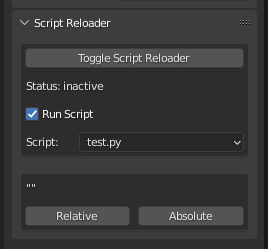
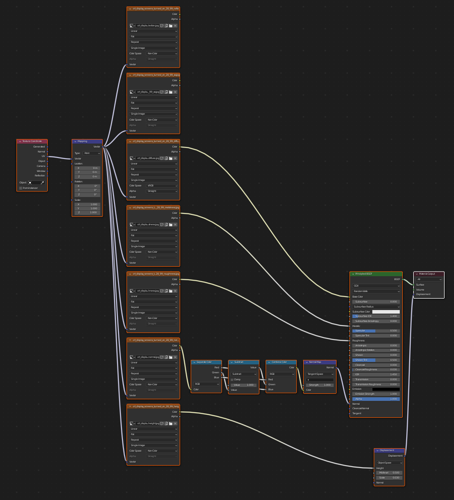

# Blender Scripts
This is a collection of various little scripts helping me through the day.

## operator_delete_context.py

Mimics my delete functionality from 3DSMax

## custom_mode_setter.py

Mimics my mode setting functionality from 3DSMax

## auto_reload_scripts.py



Checks all loaded files on a timer and reloads them. No more needing to push the red button and tell it to "reload". You can set one script to be executed after reloading.

Additional function is swapping the script path between relative and absolute path. Very useful when you need to share a script along with a blender file, as people might not use the same source path and as such scripts linked in the blender file won't be found.

## import_material_folder.py

This imports a material/texture folder structure as materials into blender. Textures are identified by keyworks:

```python
tex_keywords = {
    "ao": ["_ao", "ambientocclusion", "AmbientOcclusion", "ambientOcclusion"],
    "diffuse": ["_diffuse", "basemap", "albedo", "Albedo", "_alb"],
    "roughness": ["roughness", "_rgh", "Roughness"],
    "normal": ["_nrm", "_normal", "NormalMap", "normalmap"],
    "height": ["_height", "HeightMap", "heightmap"],
    "render": ["_render", "thumbnail", "Thumbnail"],
    "reflection": ["_reflection", "_ref", "Reflection"],
    "metal": ["_met", "metalness", "Metalness"],
    "emission": ["_emi", "Emission", "emissive"]
}
```

Setup by adding your desired folder to the script, adapt the tags and start the script. You will receive materials looking something like this:



Some features:

- Marks materials directly as assets so they can be used in blenders asset browser
- Adds a converter for DirectX style normal maps to OpenGL normal maps

Still wip, use at your own risk!
