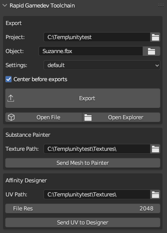

# Blender Scripts
This is a collection of various little scripts helping me through the day.

## operator_delete_context.py

Mimics my delete functionality from 3DSMax

## custom_mode_setter.py

Mimics my mode setting functionality from 3DSMax

## auto_reload_scripts.py


Checks all loaded files on a timer and reloads them. No more needing to push the red button and tell it to "reload". You can set one script to be executed after reloading.

Additional function is swapping the script path between relative and absolute path. Very useful when you need to share a script along with a blender file, as people might not use the same source path and as such scripts linked in the blender file won't be found.

## rapid_gamedev_toolchain.py



A couple of tools to improve the life of a game artist.

### Export

This defines an asset once so you can export it multiple times without the need to find the correct folder or file, improving the iteration process. It will only export the object plus all child objects.

Options are:

- **Project:** Defines the base path of the project. In Unity it's usually the Assets folder. This is stored scene-wide, so you only need to set it once no matter how many assets are in the scene.
- **Object:** The export path of the object itself. It's relative to the Project path.
- **Settings:** The FBX settings to be used on that object.
- **Center before export:** Sets the coordinates of the object to ( 0, 0, 0 ) before  exporting, centering it to the world.

**Open File** opens the FBX file directly in the default program. **Open Explorer** opens an explorer window with the exported file selected.

### Substance Painter

Sends an mesh object directly to substance painter, creates a new project with it.

You need to set the executeable path in the addon preferences to make it work. Usually the path is something like

```shell
C:\Program Files\Allegorithmic\Substance Painter\Substance Painter.exe
```

- **Texture Path**: This will be the default path Substance Painter will export textures to.

### Affinity Designer

Sends the UV's as a SVG file to an app (in my case Affinity Designer). Isn't necessarily set on what app.

Pretty useful if you want to add vector graphics onto the texture. Can be used to create purely vector textures.

- **UV Path:** Where the SVG file will be saved to.

## import_material_folder.py


I made a little demo that demonstrates how it works:

[Demo Video](https://youtu.be/O3Rofp_yQ3A)

This imports a material/texture folder structure as materials into blender. Textures are identified by keyworks:


Setup by adding your desired folder to the script, adapt the tags and start the script. You will receive materials looking something like this:


Some features:

- Marks materials directly as assets so they can be used in blenders asset browser.
- Adds tags to asset.
- Adds a converter for DirectX style normal maps to OpenGL normal maps.
- Adds a thumbnail image if there is one, otherwise generates automatic one.

Still wip, use at your own risk!
