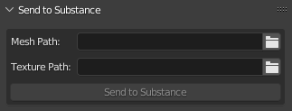
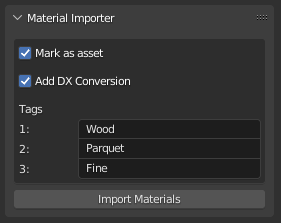
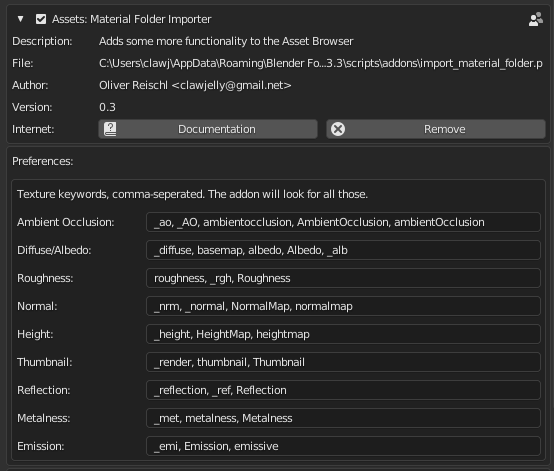

# Blender Scripts
This is a collection of various little scripts helping me through the day.

## operator_delete_context.py

Mimics my delete functionality from 3DSMax

## custom_mode_setter.py

Mimics my mode setting functionality from 3DSMax

## auto_reload_scripts.py


Checks all loaded files on a timer and reloads them. No more needing to push the red button and tell it to "reload". You can set one script to be executed after reloading.

Additional function is swapping the script path between relative and absolute path. Very useful when you need to share a script along with a blender file, as people might not use the same source path and as such scripts linked in the blender file won't be found.

## send_to_spainter.py

Sends an mesh object directly to substance painter, creates a new project with it.

You need to set the executeable path in the addon preferences to make it work. Usually the path is something like

```shell
C:\Program Files\Allegorithmic\Substance Painter\Substance Painter.exe
```



- **Mesh Path**: Optional, the file path to export the FBX to. If not set, it will export to a temporary path, so *the file isn't guaranteed to exist next time you open the project!* Unless it's a quick fire and forget project, this must be set!
- **Texture Path**: This will be the default path Substance Painter will export textures to.

## import_material_folder.py



I made a little demo that demonstrates how it works:

[Demo Video](https://youtu.be/O3Rofp_yQ3A)

This imports a material/texture folder structure as materials into blender. Textures are identified by keyworks:



Setup by adding your desired folder to the script, adapt the tags and start the script. You will receive materials looking something like this:


Some features:

- Marks materials directly as assets so they can be used in blenders asset browser.
- Adds tags to asset.
- Adds a converter for DirectX style normal maps to OpenGL normal maps.
- Adds a thumbnail image if there is one, otherwise generates automatic one.

Still wip, use at your own risk!
